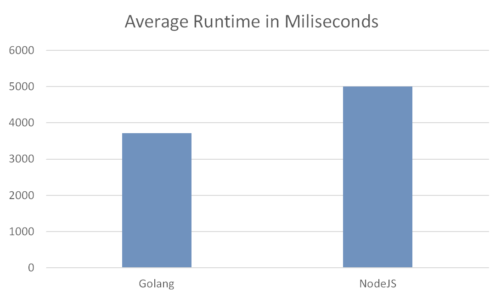

# Golang vs NodeJS Performance Test
This is a test of how fast go is compared to nodejs. I'm doing this for a school project and I only have a few days to do it so it won't be very good.

## Testing
I ran the tests with python subprocesses while Vscode and Firefox were running (I forgot to close them). The scripts I tested were run 100 times each for a total of 200 data points, taking the time in milliseconds at the start and end of each run. The time taken from each run was put into the [performance.json](https://github.com/kierancrumb/golang-vs-nodejs/blob/main/performance.json) file.

## Algorithm
My algorithm makes a list with the values `[1, 1]`, adds the sum of all the values in the array to the end of it, and reapeats that 100,000 times. The algorithm is pretty much the same in both languages.

Implementation in javascript:
```
let [arr, i] = [[1, 1], 0];

while (i < 100_000) {
  let val = 0;

  for (let e = 0; e < arr.length; e++) {
    val += arr[e];
  }

  arr.push(val);
  i += 1;
}
```

## Results
As expected Go was faster than Javascript, with a mean and median of 3713ms and 3542ms compared to 5001ms and 4964ms making Golang on average 1288ms faster than Javascript. Go was also less consistent, with an IQR of 93.5ms compared to 39.75ms, and a range of 15725ms compared to 563ms. At the start of the test Go had a major outlier of 19146ms. The test took a total of 1743.124 seconds or almost 30 minutes to run.

